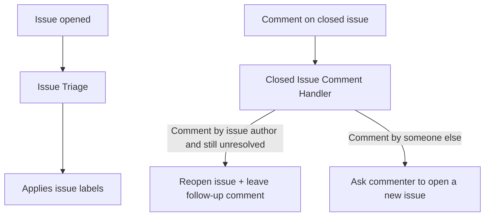
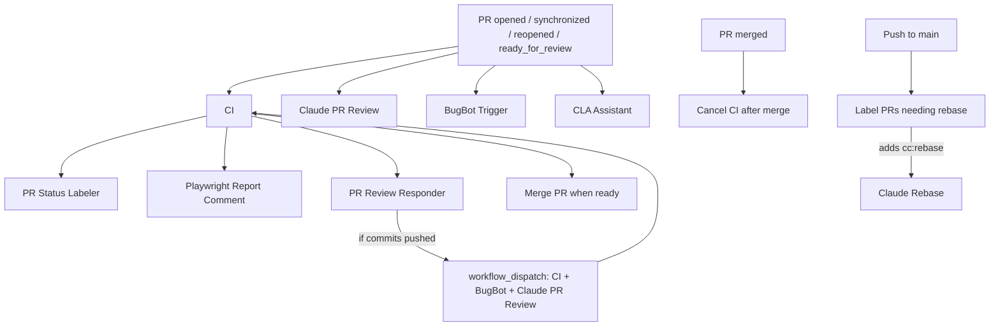

# GitHub Workflows Overview

This directory contains CI/CD, automation, triage, and release workflows.

## Issue Workflow Relationships

## PR Workflow Relationships

## Workflows

| File                         | Name                           | Description                                                                                          | Trigger                                                                                                              | Output labels                                                                                                                                                                                       |
| ---------------------------- | ------------------------------ | ---------------------------------------------------------------------------------------------------- | -------------------------------------------------------------------------------------------------------------------- | --------------------------------------------------------------------------------------------------------------------------------------------------------------------------------------------------- |
| `bugbot-trigger.yml`         | `BugBot Trigger`               | Posts `@BugBot run` on eligible PRs so BugBot starts a review.                                       | `pull_request_target` on `opened/synchronize/ready_for_review/reopened`; or `workflow_dispatch` with `pr_number`.    | None.                                                                                                                                                                                               |
| `cancel-ci-after-merge.yml`  | `Cancel CI after merge`        | Cancels still-running or queued `CI` runs for a PR commit after merge.                               | `pull_request` on `closed` (only when merged).                                                                       | None.                                                                                                                                                                                               |
| `ci.yml`                     | `CI`                           | Runs presubmit checks, type checks, unit tests, build, and Playwright E2E/report merge.              | `push` to `main`; `pull_request` on `opened/synchronize/reopened/closed`; or `workflow_dispatch` with `pr_number`.   | None.                                                                                                                                                                                               |
| `cla.yml`                    | `CLA Assistant`                | Verifies/signs contributor CLA status on PR events and specific comment commands.                    | `pull_request_target` on `opened/closed/synchronize`; plus `issue_comment` on `created` for `recheck` or CLA phrase. | No repository-specific labels set in this file.                                                                                                                                                     |
| `claude-deflake-e2e.yml`     | `Claude Deflake E2E`           | Runs an AI-assisted deflake routine over recent PR E2E failures.                                     | Daily cron (`0 10 * * *`) or `workflow_dispatch` (`pr_count`).                                                       | None.                                                                                                                                                                                               |
| `claude-pr-review.yml`       | `Claude PR Review`             | Runs Claude Code to perform automated PR review on allowed authors.                                  | `pull_request_target` on `opened/synchronize/ready_for_review/reopened`; or `workflow_dispatch` with `pr_number`.    | None.                                                                                                                                                                                               |
| `claude-rebase.yml`          | `Claude Rebase`                | Rebases an allowed-author PR after it is explicitly flagged for rebase.                              | `pull_request_target` on `labeled` (only label `cc:rebase`).                                                         | `cc:rebase` -> `cc:rebasing` while running; removes `cc:rebasing` on success; adds `cc:rebase-failed` on failure.                                                                                   |
| `claude-triage.yml`          | `Issue Triage`                 | Uses Claude to classify new issues, check duplicates, and optionally improve titles.                 | `issues` on `opened`.                                                                                                | Adds one of `bug` / `feature request` / `ux/usability`, and may add `pro`, `issue/lang`, `issue/incomplete`.                                                                                        |
| `close-stale-prs.yml`        | `Close stale PRs`              | Closes PRs older than two months and leaves an explanatory comment.                                  | Daily cron (`0 0 * * *`) or `workflow_dispatch`.                                                                     | None.                                                                                                                                                                                               |
| `closed-issue-comment.yml`   | `Closed Issue Comment Handler` | Handles new comments on closed issues and can reopen/respond based on intent.                        | `issue_comment` on `created` (closed issues only, not PRs).                                                          | None.                                                                                                                                                                                               |
| `draft-stale-prs.yml`        | `Draft stale PRs`              | Converts inactive open PRs to draft after 7 days without meaningful activity.                        | Daily cron (`0 0 * * *`) or `workflow_dispatch`.                                                                     | None.                                                                                                                                                                                               |
| `label-rebase-prs.yml`       | `Label PRs needing rebase`     | Finds conflicting open PRs from allowed authors and flags them for rebase.                           | `push` to `main`.                                                                                                    | Adds `cc:rebase` when eligible PR is conflicted (`mergeable_state == dirty`) and not already in rebase states.                                                                                      |
| `merge-pr.yml`               | `Merge PR when ready`          | Auto-merges eligible PRs after successful CI when all checks pass.                                   | `workflow_run` for `CI` on `completed` (successful PR-triggered CI only).                                            | None (reads `merge-when-ready`, does not set labels).                                                                                                                                               |
| `nightly-runner-cleanup.yml` | `Nightly Runner Cleanup`       | Safely frees disk space on self-hosted runner ci1 (caches, npm, runner \_work).                      | Daily cron (4 AM PST); or `workflow_dispatch`.                                                                       | None.                                                                                                                                                                                               |
| `playwright-comment.yml`     | `Playwright Report Comment`    | Posts a Playwright summary comment on the PR tied to a completed CI run.                             | `workflow_run` for `CI` on `completed`.                                                                              | None.                                                                                                                                                                                               |
| `pr-review-responder.yml`    | `PR Review Responder`          | Runs Claude fix loops for trusted PRs, retriggers checks/reviews, and advances request-state labels. | `workflow_run` for `CI` on `completed`.                                                                              | `cc:request`/`cc:request:N` -> `cc:pending`; then `cc:request:N+1` on pushed commits, `cc:done` on clean finish, `cc:failed` on failure; may add `needs-human:review-issue` when retries exhausted. |
| `pr-status-labeler.yml`      | `PR Status Labeler`            | Applies human-attention labels based on CI outcome and review freshness/verdict.                     | `workflow_run` for `CI` on `completed`.                                                                              | Swaps between `needs-human:final-check` (clean + passing) and `needs-human:review-issue` (failing/stale/missing/issueful review).                                                                   |
| `release.yml`                | `Release app`                  | Manually builds and publishes signed release artifacts across platforms, then verifies assets.       | `workflow_dispatch`.                                                                                                 | None.                                                                                                                                                                                               |

## Nightly Runner Cleanup

The `nightly-runner-cleanup.yml` workflow runs at 4:00 AM PST on self-hosted macOS runner `ci1` to reclaim disk space. It only runs when `RUNNER_NAME == ci1`; other runners skip cleanup.

**Validation (manual run):**

1. Go to Actions → Nightly Runner Cleanup → Run workflow.
2. Confirm the run completes successfully and logs show "Running cleanup on runner: ci1".
3. Check logs for "Disk before" and "Disk after" to verify space reclaimed.
4. On non-ci1 runners, logs should show "Skipping cleanup" and exit successfully.

**Expected behavior:** Deletes only allowlisted paths (npm cache, Playwright browsers, runner \_work dirs older than 2 days, Library/Caches subdirs). Never removes runner binaries, config, or user data outside caches.
